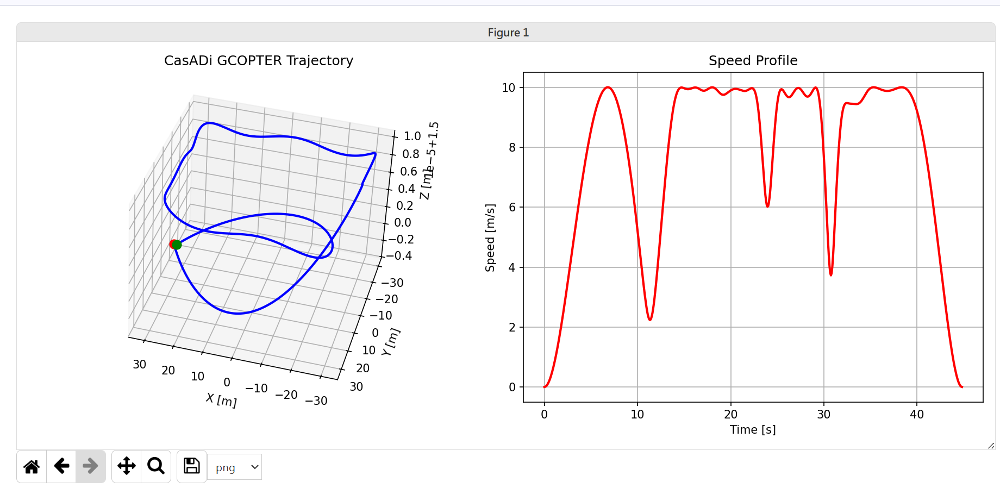

# MINCO-Python

[](https://python.org)
[](https://isocpp.org)
[](LICENSE)

**Python bindings for MINCO (Minimum Control Effort) trajectory optimization library** - A high-performance trajectory planning framework for multirotor and fixed-wing aircraft.



## Overview

MINCO-Python is a Python-first trajectory optimization library that provides efficient trajectory planning capabilities for unmanned aerial vehicles. Based on the [MINCO](https://github.com/ZJU-FAST-Lab/GCOPTER.git) framework, this project removes ROS dependencies and exposes a clean Python interface while maintaining the high-performance C++ backend.

## Key Features

- 🚀 **Python-First Design**: Native Python interface with NumPy integration
- ⚡ **High Performance**: C++17 backend with O(N) banded system solvers
- 🎯 **CasADi Integration**: Automatic differentiation for flatness models
- 🔧 **Configurable**: YAML-based configuration system
- 📊 **Visualization**: Built-in matplotlib support with interactive plotting
- 🧪 **Well-Tested**: Comprehensive test suite with validation examples

## Architecture

### Core Components

**C++ Backend:**
- `minco.hpp` - Banded system solver with O(N) complexity
- `gcopter.hpp` - GCOPTER trajectory optimizer with geometric control
- `flatness.hpp` - Differential flatness mapping for multirotor dynamics
- `trajectory.hpp` - Piecewise polynomial trajectory representation

**Python Bindings:**
- Complete pybind11 bindings with NumPy array support
- Automatic Python type stub generation (.pyi files)
- CasADi automatic differentiation integration

**Configuration System:**
- YAML configuration files for aircraft parameters
- Customizable flatness model definitions
- LBFGS optimizer parameter tuning

## Installation

### Prerequisites

- Python 3.8+
- C++17 compatible compiler
- Eigen3 library
- yaml-cpp library

### Install C++ Dependencies

```bash
# Install required C++ libraries
sudo apt install libyaml-cpp-dev libeigen-dev
```

### Install uv Package Manager

```bash
curl -LsSf https://astral.sh/uv/install.sh | sh
```

### Install Python Dependencies

```bash
# Install all Python dependencies
uv sync
```

### Build and Install

```bash
# Build C++ extensions and install Python package
uv pip install -e . --no-deps
```

### Generate Type Stubs [Optional]

```bash
# Generate pybind11 type hints for better IDE support
uv run pybind11-stubgen minco
```

The generated stub files will be automatically placed alongside the compiled module.

## Quick Start

```python
import numpy as np
import minco

# Create a simple trajectory
trajectory = minco.Trajectory()
# Generate trajectory points
points = np.array([[0, 1, 2, 3],
                   [0, 1, 0, 1],
                   [1, 1, 1, 1]])
# Optimize trajectory
trajectory.optimize(points)
```

## Development Roadmap

- [ ] **LBFGS → SQCQP**: Upgrade optimization algorithm
- [ ] **Enhanced API**: More natural Python interface design
- [ ] **Fixed-Wing Support**: Add fixed-wing/VTOL differential flatness models
- [ ] **Real-time Planning**: Real-time trajectory generation capabilities

## Configuration

Configuration files are located in the `config/` directory:

- `default_gcopter.yaml` - Main trajectory optimization parameters
- `default_flatness_config.yaml` - Flatness model parameters
- `lbfgs.yaml` - Optimizer configuration
- `casadi_quadrotor_flatness.yaml` - CasADi flatness model

### Key Configuration Sections

1. **Cost Function Configuration** (`costfunc_config`)
   - Weight matrices for position, velocity, acceleration
   - Physical constraints (velocity, thrust limits)
   - Smoothness factors

2. **LBFGS Optimizer Configuration** (`lbfgs_config`)
   - Convergence tolerances
   - Maximum iterations
   - Line search parameters

## Supported Trajectory Shapes

The library includes built-in trajectory generators for:

- 🔵 **Circular** trajectories
- **8-Shaped** trajectories
- **Square** trajectories
- Custom waypoint-based trajectories

## Testing

Run the test suite:

```bash
# Run all tests
uv run pytest

# Run specific test
uv run pytest tests/test_gcopter_casadi_visualization.py
```

### Test Categories

- **Flatness Tests**: Validate differential flatness implementations
- **GCOPTER Tests**: Test trajectory optimization with various constraints
- **Visualization Tests**: Interactive trajectory plotting and validation
- **CasADi Tests**: Automatic differentiation and gradient computation

## Applications

- Multirotor UAV trajectory planning
- Learning-based control research
- Aircraft dynamics simulation
- Trajectory optimization algorithm validation
- Real-time motion planning

## Project Structure

```
minco-python/
├── src/minco_trajectory/     # C++ source code
│   ├── include/              # Header files
│   ├── src/                  # Implementation
│   └── src/bindings/         # Python bindings
├── tests/                    # Test suite
├── config/                   # Configuration files
├── docs/                     # Documentation
└── tools/                    # Build utilities
```

## Technical Details

### Differential Flatness

The project uses differential flatness theory to transform complex 3D trajectory planning problems into simpler flat space optimization. The flatness mapping handles:

- Forward mapping: flat variables → physical states (position, velocity, acceleration)
- Backward mapping: physical state gradients → flat variable gradients

### Optimization

Trajectory optimization is performed using LBFGS with:
- Piecewise polynomial trajectory representation
- Physical constraints (velocity, acceleration, thrust limits)
- Smoothness regularization terms
- Boundary condition enforcement

## Contributing

1. Fork the repository
2. Create a feature branch
3. Add tests for new functionality
4. Ensure all tests pass
5. Submit a pull request

## License

This project is licensed under the MIT License - see the [LICENSE](LICENSE) file for details.

## Acknowledgments

- Based on the [MINCO](https://github.com/ZJU-FAST-Lab/GCOPTER) framework from ZJU FAST Lab
- Built with [Eigen](https://eigen.tuxfamily.org) for linear algebra
- Python bindings powered by [pybind11](https://github.com/pybind/pybind11)
- Symbolic computation with [CasADi](https://web.casadi.org)

## Citation

If you use this library in your research, please cite:

```bibtex
@software{minco_python,
  title={MINCO-Python: Python Bindings for Minimum Control Effort Trajectory Optimization},
  author={Hanamy},
  year={2024},
  url={https://github.com/hanamy/minco-python}
}
```